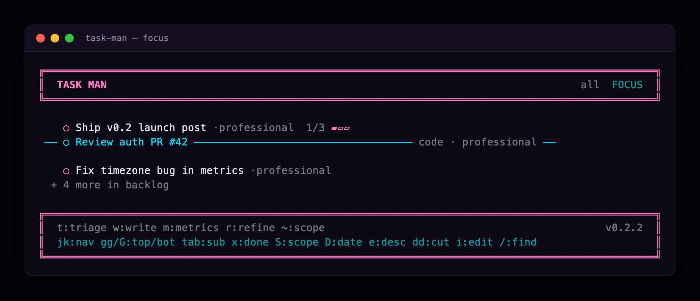
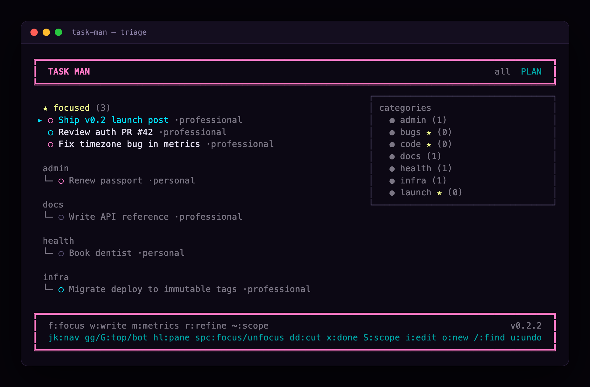
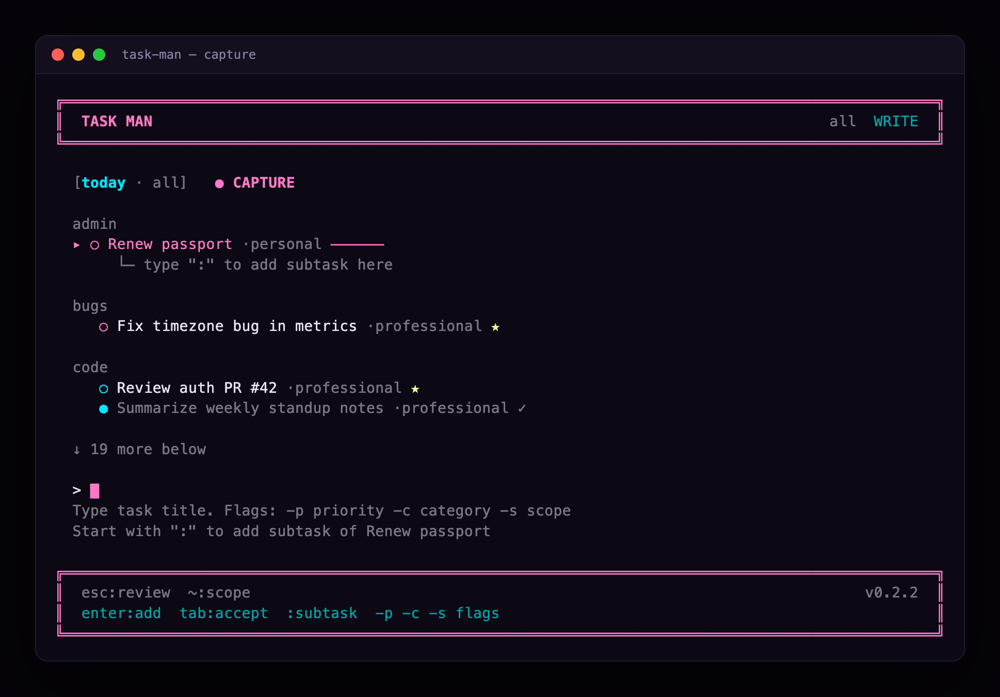
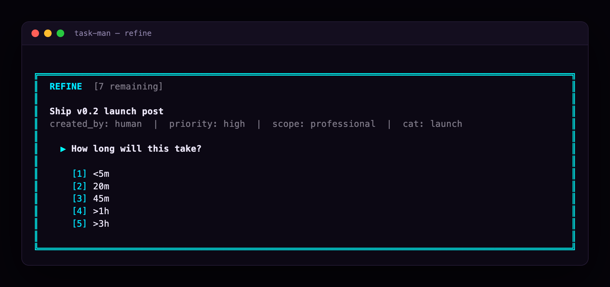
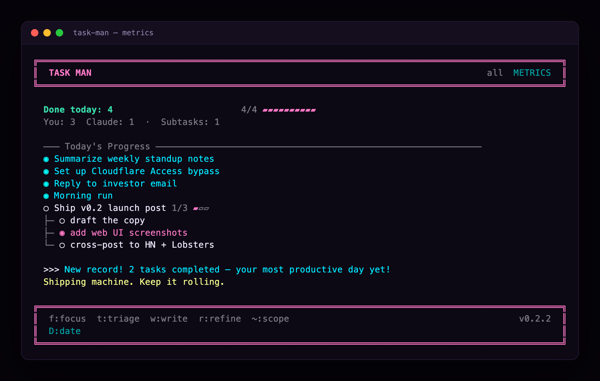
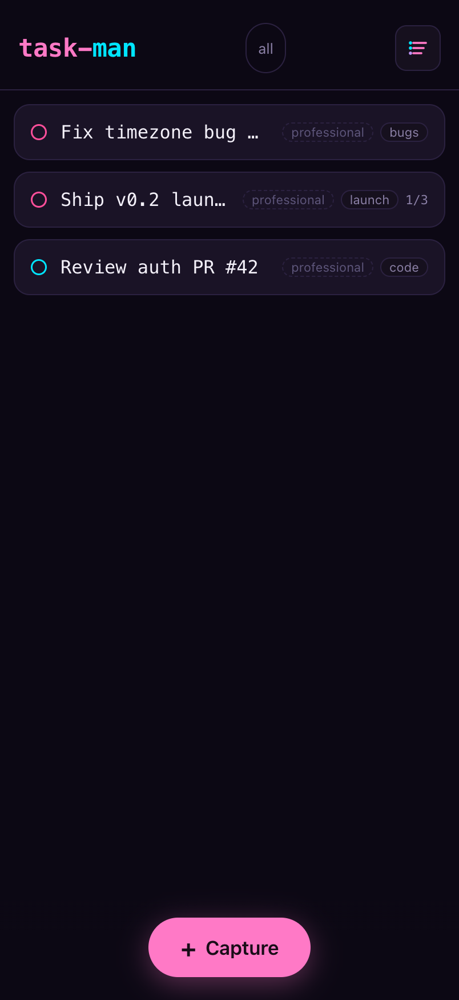
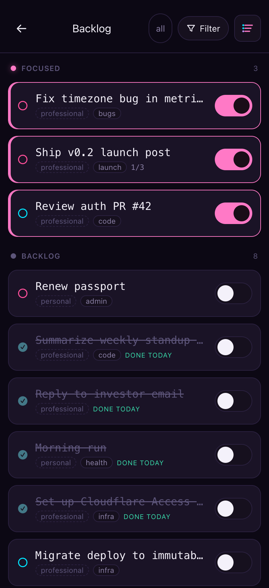
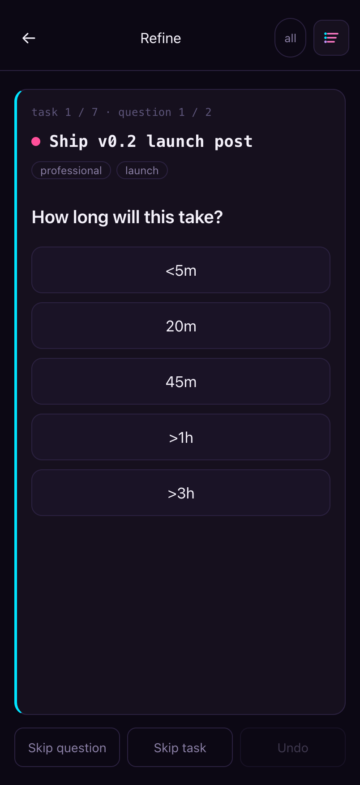
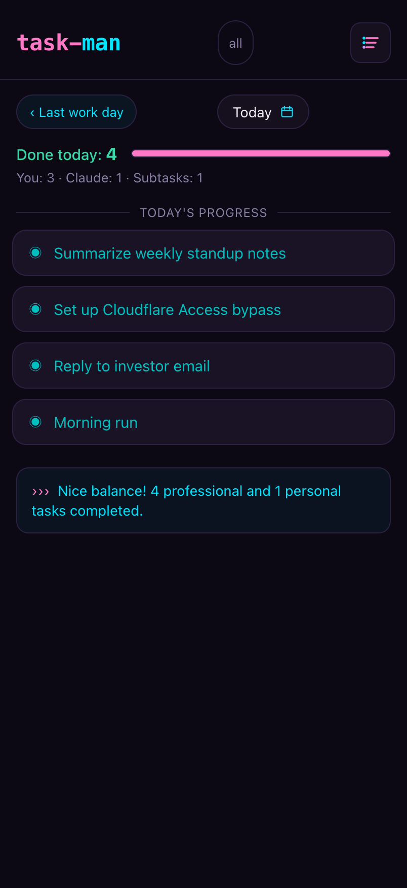

# task-man

**A focus-first task manager you run from three places at once — your terminal, your phone, and Claude.** Pull a few things into a tight working set, triage the rest, and let Claude capture and refine tasks over MCP. One store, synced live through a small server you host behind Cloudflare Access, so every surface sees the same tasks and each person sees only their own.

<p align="center"></p>
<p align="center"><em>The terminal UI — your working set, keyboard-driven.</em></p>

## Three surfaces, one working set

- **⌨️ Terminal** — a vim-keyed TUI for planning and doing the work where you already live: a focus list, a triage/plan view, capture, refine, and metrics — all keyboard-driven.
- **📱 Phone** — a fast, installable web app. Add it to your home screen and it feels native: swipe your focus list, triage the backlog, refine with a card-flip flow, and see your end-of-day metrics.
- **🤖 Claude** — an MCP server so Claude can add, prioritize, and refine tasks, and email you a wrap-up report at day's end.

On the hosted path all three read and write the **same** tasks through your server, and authorization is per-identity — you see your tasks, Claude's agents see theirs.

## In the terminal

The full keyboard workflow — vim keys, no mouse.

<p align="center"></p>
<p align="center"><em>Triage — focused tasks pinned on top, the unfocused backlog grouped by category, with a live category panel. <code>Space</code> promotes/demotes; the cursor rides the task as it moves.</em></p>

<p align="center"></p>
<p align="center"><em>Capture — jot tasks fast with inline flags (<code>-p</code> priority, <code>-c</code> category, <code>-s</code> scope); <code>:</code> attaches a subtask to the last thing you added.</em></p>

<p align="center"></p>
<p align="center"><em>Refine — rapid card-flip triage, one keystroke per answer.</em></p>

<p align="center"></p>
<p align="center"><em>Metrics — the end-of-day report: what got done, the you-vs-Claude split, subtasks, and an insight line.</em></p>

## On your phone

The same working set as a tap-driven web app — add it to your home screen and it feels native.

<p align="center">
  
  
  
  
</p>
<p align="center"><em>The phone web app — Focus · Backlog · Refine · Metrics.</em></p>

**What each screen does**
- **Focus** — the small set you've committed to. Priority dots, categories, subtask progress, one tap to capture.
- **Backlog** — everything else, with your **focused tasks pinned on top** so you can promote and demote the working set in one place. Done-today items stay visible with a strikethrough.
- **Refine** — rapid-fire triage: one card per unfinished detail (scope, time estimate, vibe, priority, category), answered with a tap. Skip anything, undo the last.
- **Metrics** — the day report: what got done, you-vs-Claude split, subtasks, and a short insight ("Nice balance! 4 professional and 1 personal…").

## Run it — the hosted path (recommended)

This is the real experience: terminal + phone + Claude, in sync from anywhere.

1. **Deploy the server.** `cli/Dockerfile` + `deploy/docker-compose.yml` build the Hono API + web app straight from a checkout — no npm registry involved. A $6 droplet is plenty.
2. **Put it behind Cloudflare Access.** A Cloudflare Tunnel exposes it with no open ports, and Access gates the hostname; the server *also* verifies Access's signed JWT on every API request, so nothing is reachable unauthenticated.
3. **Point your laptop at it.** Set the TUI/MCP to remote mode (`client.mode = "remote"`, `remote_url = "https://tasks.<your-domain>"`) — the same binaries now read and write the hosted store.
4. **Add the web app to your phone's home screen** and you're live on all three surfaces.

Full step-by-step (DigitalOcean droplet + Cloudflare Tunnel + Access, including the auth and release-tagging workflow): **[`docs/phase2-manual-setup-guide.md`](./docs/phase2-manual-setup-guide.md)**.

## Run it locally (optional — no server, no account)

Just want to try it on one machine with plain file storage? Skip all the hosting:

```bash
git clone https://github.com/mmmende2/task-man.git
cd task-man && npm install && npm run build -w task-man    # workspace root
cd cli && npm link                                          # expose `task-man` globally

task-man --version    # confirm install
task-man              # launch the TUI — tasks live in ~/.task-man/tasks.json

# Register the MCP server with Claude Code:
claude mcp add task-man -- task-man-mcp
```

No sign-in, no network — everything stays in `~/.task-man/`. You can move to the hosted path later by flipping the client config to `remote`; your data and workflow are identical.

## Under the hood

The TUI and MCP code against one async `Store` interface. `LocalStore` (the default) wraps an in-process file store; `RemoteStore` speaks HTTPS to a hosted instance of the *same* Hono server behind Cloudflare Access. The web SPA talks HTTP to its own origin.

```
                      ~/.task-man/  (local)          hosted server (remote)
                  tasks.json · config.json     ┌───────────────────────────┐
                            ▲                   │  Hono API + web app        │
                            │ TaskStore         │  /api  ·  /api/store       │
                     ┌──────┴──────┐            │  Cloudflare Access JWT     │
                     │   Store     │            └──────────────▲────────────┘
                     │ Local ──────┤                           │ HTTPS
                     │ Remote ─────┼────── Cloudflare Access ───┘
                     └──▲───────▲──┘
                  ┌─────┴──┐ ┌──┴──────────┐        ┌──────────────┐
                  │  TUI   │ │ MCP          │        │  phone web   │
                  │ (cli/) │ │ (cli/src/mcp)│        │  app (web/)  │
                  └────────┘ └──────────────┘        └──────────────┘
```

### Packages

| Path | Package | What it is |
|------|---------|------------|
| [`cli/`](./cli/README.md) | `task-man` | The one publishable package: TUI, bundled Hono server + web app, and the MCP server as a second bin (`task-man-mcp`). |
| [`web/`](./web/README.md) | `task-man-web` (private) | Vite/React SPA for phone / second-device access. Built output is embedded into the CLI as `cli/dist-web/`. |
| [`mcp/`](./mcp/README.md) | — | MCP setup docs + full tool reference (code lives in `cli/src/mcp/`). |

## Documentation

- [`docs/release-deploy-quickstart.md`](./docs/release-deploy-quickstart.md) — versioning (Changesets), writing a changeset, cutting a release, and deploying
- [`docs/phase2-manual-setup-guide.md`](./docs/phase2-manual-setup-guide.md) — deploy behind Cloudflare Tunnel + Access, and the release workflow in full
- [`cli/README.md`](./cli/README.md) — CLI, TUI keybindings, `task-man serve`, remote config
- [`web/README.md`](./web/README.md) — web dev and build flow
- [`mcp/README.md`](./mcp/README.md) — MCP setup and full tool reference
- [`docs/system-map.md`](./docs/system-map.md) — terse architecture reference (layers, seams, run modes)
- [`PRD.md`](./PRD.md) — product requirements
